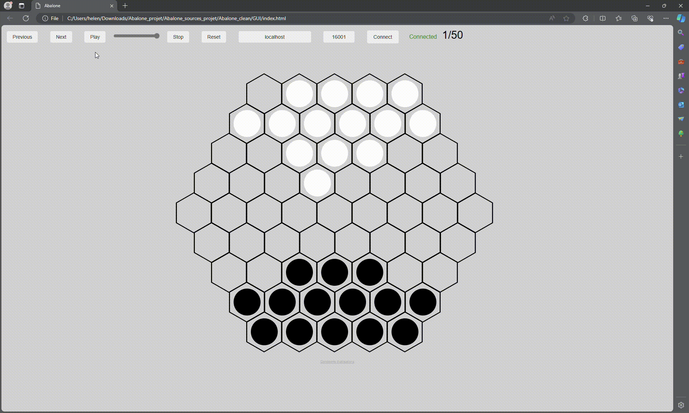

# Abalone_Game_Agent
AI and Heuristic-Based Abalone Game Agent

## Introduction
This project implements an intelligent agent designed to play the board game Abalone. Utilizing a combination of artificial intelligence (AI) strategies and heuristics, the agent aims to effectively challenge human players or other AI opponents in the game. The agent's logic is grounded in evaluating game states, making strategic moves, and anticipating opponent actions to gain an advantage.

## Features
Strategic Gameplay: Employs a mix of predefined heuristics and dynamic decision-making to play Abalone strategically.
Game State Evaluation: Analyzes the board to make informed decisions based on the current and potential future states.
Heuristic Algorithms: Utilizes custom heuristic algorithms to assess move quality and prioritize actions.
Setup
Requirements
Python 3.x
NumPy 
To install: do pip install -r requirements.txt

## Installation
Ensure Python 3 and pip are installed on your system.
Clone the repository or download the source code.
pip install -r requirements.txt
Usage

To run the Abalone game agent:
Navigate to the project directory.
Run the following command in the terminal:
python main_abalone.py -t local my_player_1.py random_player_abalone.py
Follow the on-screen instructions to start the game.

## How It Works
The agent's logic is based on evaluating the board's state to determine the best possible moves. It uses a combination of direction mapping, neighbor identification, and distance calculation to strategize its moves. The agent prioritizes actions based on the potential to push opponent pieces off the board while ensuring its pieces remain safe.

## Demonstration

This section showcases the performance of our Abalone game agent in action. Witness the strategic depth and decision-making capabilities of our AI in two distinct scenarios: battling a random player and engaging in a self-play scenario to refine its strategy.

### My Player vs. Random Player

  

### My Player vs. Itself

  

## Contributing
Contributions to the project are welcome! Please fork the repository and submit pull requests with your proposed changes. Ensure your code adheres to the project's coding standards and include comments for clarity.

## Acknowledgments
This project was inspired by the strategies and gameplay of the traditional Abalone board game.

